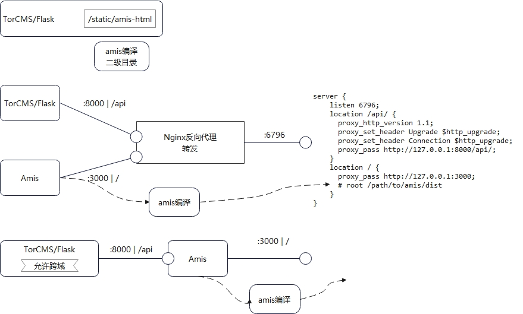

amis 实战教程-1-环境搭建/登录功能实现

## 背景说明

此项目的开发说明，原地址： https://juejin.cn/post/7122021869158400013 ，
或参考 `docs` 文件夹下说明。

项目地址： https://github.com/mrsdpz/amis-admin.git

参考自官方项目： https://github.com/aisuda/amis-admin.git

## 环境搭建

1. 安装 nodejs,npm,git,python,nginx

**nginx安装：**
    sudo su
    apt-get install nginx

按照自己的操作系统自行百度/谷歌

2. nginx 转发解决跨域

找到 nginx 的配置文件, Debian/Ubuntu 使用 apt 安装的一般在/etc/nginx 下, 
添加的配置文件，放在 `/etc/nginx/sites-enabled` 。

在 nginx 配置文件中添加文件 `torcms-amis.nginx` ，内容如下：

    server {
    # 通过浏览器访问的端口
    listen 6796;    
    # 转发至 TorCMS 端口
    location /api/ { 
      proxy_http_version 1.1;
      proxy_set_header Upgrade $http_upgrade;
      proxy_set_header Connection $http_upgrade;
      proxy_pass http://127.0.0.1:5555/api/;
    }    
    # 转发至 Amis 的端口
    location / {
      proxy_pass http://127.0.0.1:3000;
    }
    }

重新启动 

    sudo service nginx restart

## 本地开发环境搭建

### 前端环境

进入项目目录 `amis-torcms` ,依次执行

    npm install
    npm run start

服务默认启动在 3000 端口,打开浏览器访问 http://localhost:3000

### 后端环境

运行 TorCMS ，注意端口，及路由。

访问 http://localhost:8000/api/hello

### 访问完整环境

访问  http://localhost:6796