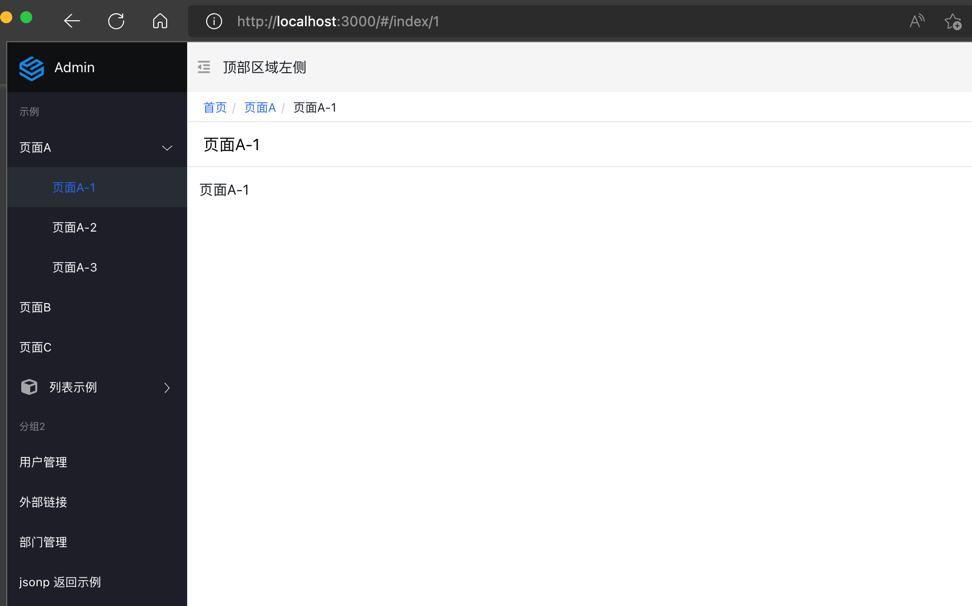
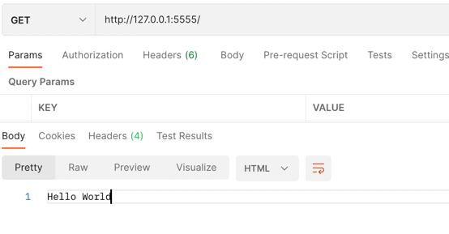
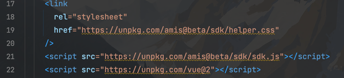

# amis-admin 环境准备

## 什么是 amis

amis 是一个低代码前端框架，它使用 JSON 配置来生成页面，可以减少页面开发工作量，极大提升效率。

官方文档地址:https://baidu.github.io/amis/zh-CN/docs/index

github 地址: https://github.com/baidu/amis

官方提供的admin项目地址: https://github.com/aisuda/amis-admin  
本文以 amis-admin 项目为基础,在此之上进行开发,所有的代码以及文章在: https://github.com/mrsdpz/amis-admin 仓库中


## 为什么写 amis 的教程
本人从事运维开发工作,前端水平嘛也就只有一点东西,但东西不多,看得懂,能照着写,复杂一点的需求就会有点吃力,另外接手的一个项目前端写得一塌糊涂,看着近五千行的一个页面头皮发麻,于是有了重写的念头,发现了 amis 这个框架后,感觉很适合自己,不要太多的前端知识便能入手,便开始着手开发,过程中除了官方文档外资料极少,github 上提 issue 官方也是爱答不理,唯有自己一点点的踩坑,不过这个过程也加深了自己对 amis 的了解,便想将自己使用的经验分享出来,供大家参考


**注意: 本文并非 amis 的最佳实践,官方也没有提供一个所谓的使用标准,仅是自己在实际开放过程中琢磨出来的一些东西,当然,有些东西会有点鸡贼,同时本文不是 amis 的入门教程,请先阅读官方文档了解基本概念,当然每个知识点设计的概念我都会附上官方文档的地址,方便查阅**


## 环境搭建
### 1. 安装 nodejs,npm,git,python,nginx
按照自己的操作系统自行百度/谷歌

### 2. nginx 转发解决跨域

找到 nginx 的配置文件,yum 或 apt-get 安装的一般在/etc/nginx 下,
brew 安装的在`/opt/homebrew/etc/nginx`下  

首先添加本地 host,unix 系在/etc/hosts,Windows 位于C:\Windows\System32\drivers\etc, 在 hosts文件中添加以下一行:
```
127.0.0.1 www.amis.com
```

在 nginx 配置文件中添加
```
server {
listen 80;
server_name www.amis.com;
location /api/ {
  proxy_http_version 1.1;
  proxy_set_header Upgrade $http_upgrade;
  proxy_set_header Connection $http_upgrade;
   proxy_pass http://127.0.0.1:5555/api/;
 }

location / {
  proxy_pass http://127.0.0.1:3000;
}
}
```

启动 nginx

### 3. 本地开发环境搭建  
### 前端环境
下载 amis-admin
`git clone https://github.com/aisuda/amis-admin`

进入刚刚下载的项目,依次执行  
`npm install`  
`npm run start`  
服务默认启动在 3000 端口,打开浏览器访问`localhost:3000`或者`http://www.amis.com/`


### 后端环境
安装 Flask  
`pip install Flask`

启动 api 服务
```
cd api  
python api.py
```

访问`localhost:5555/api/hello`或者`http://www.amis.com/api/hello`



显示`Hello World`

自此开发环境搭建成功


## 项目配置

### 1.开启热部署

打开`package.json`,修改 scripts 中 start 命令为
```
"start": "nodemon server.js",
```
重启前端后命令行显示


不过这里有个地方需要注意： 当nodemon重启后，页面是立即刷新的，这可能会导致浏览器加载的还是原来的页面，因为编译过程需要时间,仍需要手动刷新

vscode 有插件可以调整,不过我不用 vscode,没有尝试过,具体操作如下:
https://blog.csdn.net/weixin_43895292/article/details/118841964

### 2.下载 SDK 文件
打开 index.html 文件,我们可以看到


引用的 js 和 css 文件不在本地,这里我们固定住 amis 的版本,
执行`npm install amis`
在 `node_modules/amis` 中找到 `sdk` 文件夹,复制到 `amis-admin` 项目根路径下,在 server.js 文件中找到

```
app.use('/public', express.static('public'));
app.use('/pages', express.static('pages'));
```
这两行,这下面添加以下一行
```
app.use('/sdk', express.static('sdk'));
```

修改 `index.html` 中的文件引用为
```
    <link
      rel="stylesheet"
      title="default"
      href="sdk/sdk.css"
    />
    <link
      rel="stylesheet"
      href=sdk/helper.css"
    />
    <script src="sdk/sdk.js"></script>
```

即去掉了`https://unpkg.com/amis@beta/`前缀


## 登录实战

下面我们使用 cookie 来实现 amis-admin 这个项目的登录功能

### 登录接口

```h
url: /api/v1/login
body: {
    username: 'admin',
    password: 'admin123'
}
response: 
{
  "data": {
    "username": "admin"
  }, 
  "msg": "登录成功", 
  "status": 0
}
```

接口请求成功本地存储用户信息,返回头添加 set_cookies,设置一个 cookie  amisToken="2022-07-18 21:04:20", 
值为登录的时间,方便判断登录是否成功,expire为一小时

十分简单的一个接口

### 登录页面

继续来看前端  
打开https://baidu.github.io/amis/zh-CN/docs/start/getting-started,
使用官方的这个hello demo,在 amis-admin 根路径下新建文件 login.html  


将文档中的 hello.html 的内容复制进来,修改引用的文件为我们 sdk 文件夹的路径,如下:
```html
<!DOCTYPE html>
<html lang="zh">
<head>
    <meta charset="UTF-8" />
    <title>amis demo</title>
    <meta http-equiv="Content-Type" content="text/html; charset=utf-8" />
    <meta
            name="viewport"
            content="width=device-width, initial-scale=1, maximum-scale=1"
    />
    <meta http-equiv="X-UA-Compatible" content="IE=Edge" />
    <link rel="stylesheet" href="sdk/sdk.css" />
    <link rel="stylesheet" href="sdk/helper.css" />
    <link rel="stylesheet" href="sdk/iconfont.css" />
    <!-- 这是默认主题所需的，如果是其他主题则不需要 -->
    <!-- 从 1.1.0 开始 sdk.css 将不支持 IE 11，如果要支持 IE11 请引用这个 css，并把前面那个删了 -->
    <!-- <link rel="stylesheet" href="sdk-ie11.css" /> -->
    <!-- 不过 amis 开发团队几乎没测试过 IE 11 下的效果，所以可能有细节功能用不了，如果发现请报 issue -->
    <style>
        html,
        body,
        .app-wrapper {
            position: relative;
            width: 100%;
            height: 100%;
            margin: 0;
            padding: 0;
        }
    </style>
</head>
<body>
<div id="root" class="app-wrapper"></div>
<script src="sdk/sdk.js"></script>
<script type="text/javascript">
    (function () {
        let amis = amisRequire('amis/embed');
        // 通过替换下面这个配置来生成不同页面
        let amisJSON = {
            type: 'page',
            title: '表单页面',
            body: {
                type: 'form',
                mode: 'horizontal',
                api: '/saveForm',
                body: [
                    {
                        label: 'Name',
                        type: 'input-text',
                        name: 'name'
                    },
                    {
                        label: 'Email',
                        type: 'input-email',
                        name: 'email'
                    }
                ]
            }
        };
        let amisScoped = amis.embed('#root', amisJSON);
    })();
</script>
</body>
</html>
```

表单文档: https://baidu.github.io/amis/zh-CN/components/form/index  
表单项文档:https://baidu.github.io/amis/zh-CN/components/form/formitem

下面我们来修改一下表单的接口和细节
```js
{
    type: 'form',
    mode: 'horizontal',
    api: '/api/v1/login',
    body: [
        {
            label: '用户名',
            type: 'input-text',
            name: 'username'
        },
        {
            label: '密码',
            type: 'input-password',
            name: 'password'
        }
    ]
}
```


配置登录路由,在`server.js`中找到

```javascript
app.get('/*', function (req, res) {
  res.sendFile(path.join(__dirname, 'index.html'));
});
```

在这一行上面添加

```javascript
app.get('/login', function (req, res) {
    res.sendFile(path.join(__dirname, 'login.html'));
});
```

浏览器访问`www.amis.com/login`, 用户密码为 admin/admin123


查看`form` 组件的文件有以下配置实现跳转

| redirect | `string` |      | 设置此属性后，Form 保存成功后，自动跳转到指定页面。支持相对地址，和绝对地址（相对于组内的）。 |
| -------- | -------- | ---- | ------------------------------------------------------------ |
|          |          |      |                                                              |

在`login.html`中的 `form` 表单配置中添加

```
redirect: "/"
```

api 请求成功后跳转至`/`,进入 index.html 页面

接口成功后我们再添加一个 cookie,写入返回信息中的username,这里会用到 amis 的适配器,所谓适配器,其实就是常说的中间件,amis 有两种适配器:

**请求适配器**:接口请求前修改请求内容,[点击查看文档](https://baidu.github.io/amis/zh-CN/docs/types/api#%E9%85%8D%E7%BD%AE%E8%AF%B7%E6%B1%82%E9%80%82%E9%85%8D%E5%99%A8)

**接收适配器**:接口返回后修改返回体,[点击查看文档](https://baidu.github.io/amis/zh-CN/docs/types/api#%E9%85%8D%E7%BD%AE%E6%8E%A5%E6%94%B6%E9%80%82%E9%85%8D%E5%99%A8)

这里我们使用**接收适配器**在请求成功后设置 cookie,最终我们的登录页面表单代码如下:

```javascript
{
    type: 'page',
    title: '表单页面',
    body: {
        type: 'form',
        mode: 'horizontal',
        api: {
            url: '/api/v1/login',
            method: 'post',
            adaptor: function (payload, response) {
                if (payload.status === 0) {
                    let newDate = new Date();//获取当前的时间对象
                    let nowTimeStamp = newDate.getTime();//获取当前时间对象的时间戳
                    nowTimeStamp += (3600);
                    newDate.setTime(nowTimeStamp);
                    let expires = "expires=" + newDate.toGMTString();
                    document.cookie = `username=${payload.data.username};${expires};`;
                }
                return payload
            },
        },
        redirect: "/",
        body: [
            {
                label: '用户名',
                type: 'input-text',
                name: 'username'
            },
            {
                label: '密码',
                type: 'input-password',
                name: 'password'
            }
        ]
    }
}
```


同样使用**请求适配器**即可在接口发起请求前校验cookie 中是否存在`amisToken`

但是这里我们使用另外一种方式,通过 express 的中间件来校验 cookie,在后面的文章也会使用到这个中间件.

安装cookie-parser

```shell
npm install cookie-parser --save-dev
```


在`server.js`中添加

```javascript
...
const Cookie = require('cookie-parser');
...
app.use(Cookie())
...
function AuthMiddleware(req, res, next) {
    if (req.url.startsWith('/login')) {
        next()
        return
    }
		// 如果cookie 中不存在amisToken重定向至 login 页面
    if (!req.cookies.amisToken) {
        res.redirect("/login")
        return
    }
    next();
}
app.use(AuthMiddleware)

```

完整代码如下:

```javascript
const express = require('express');
const http = require('http');
const path = require('path');
const reload = require('reload');
const bodyParser = require('body-parser');
const logger = require('morgan');
const Cookie = require('cookie-parser');

const app = express();

app.set('port', process.env.PORT || 3000);
app.use(logger('dev'));
app.use(bodyParser.json()); // Parses json, multi-part (file), url-encoded
app.use(Cookie())

app.use('/public', express.static('public'));
app.use('/pages', express.static('pages'));
app.use('/sdk', express.static('sdk'));

function AuthMiddleware(req, res, next) {
    if (req.url.startsWith('/login')) {
        next()
        return
    }

    if (!req.cookies.amisToken) {
        res.redirect("/login")
        return
    }
    next();
}
app.use(AuthMiddleware)

app.get('/login', function (req, res) {
    res.sendFile(path.join(__dirname, 'login.html'));
});
app.get('/*', function (req, res) {
  res.sendFile(path.join(__dirname, 'index.html'));
});

const server = http.createServer(app);

// Reload code here
reload(app)
  .then(function (reloadReturned) {
    // reloadReturned is documented in the returns API in the README

    // Reload started, start web server
    server.listen(app.get('port'), function () {
      console.log(
        'Web server listening on port http://localhost:' + app.get('port')
      );
    });
  })
  .catch(function (err) {
    console.error(
      'Reload could not start, could not start server/sample app',
      err
    );
  });


```

好了,登录功能就此实现.

但是还是有优化的空间,在 表单配置的 api 中,url中有`/api/v1`这个统一前缀表示 api 版本,若是未来切换版本岂不是需要批量修改所有的 api 路径?

或者在项目中写全了路径多个环境如何修改域名?比如我们表单中的 api 写成

```
url: 'http://www.amis.com/api/v1/login'
```

其实有两种解决办法:

1.通过props传递一个全局变量,api 拼接变量成完整的 url

2.使用全局请求适配器修改请求的 url

login.html 这个文件不好具体讲解,下一章在实际业务处理中给出详细代码


## yaml 代替 json


使用 json 写代码,会出现大量的括号,如果层级过深,缩进也是噩梦,并且 json 的可读性也不如 yaml,那么能不能用 yaml 写具体的代码,转换成 json 执行呢?

下面我们来具体实现

1.安装js-yaml 用于解析 yaml

```
npm install js-yaml
```

进入`node_modules/js-yaml/dist`  找到`js-yaml.js`文件复制到`public`文件夹内,

在 `index.html`中引用进来

```
<script src="./public/js-yaml.js"></script>
```

在 `amis-admin` 根目录下新建 `yaml` 文件夹,在`server.js`中新增静态文件路由,与上面添加 `sdk`一致

```
app.use('/yaml', express.static('yaml'));
```

在`yaml`文件夹中新建`time.yaml`

```
type: page
title: 时间
body:
  type: service
  dataProvider: |
    const timer = setInterval(() => {
     setData({date: new Date().toString()})
    }, 1000);
    return () => { clearInterval(timer) }
  body:
    type: tpl
    tpl: ${date}

```

此案例见[官网文档点击查看](https://baidu.github.io/amis/zh-CN/components/service#%E8%B0%83%E7%94%A8%E5%A4%96%E9%83%A8%E5%87%BD%E6%95%B0%E8%8E%B7%E5%8F%96%E6%95%B0%E6%8D%AE)

**注意:yaml 中写 js 代码需使用使用字符串形式**

两者区别:

time.yaml 的内容等价于

**字符串形式**

```json
{
  "type": "page",
  "body": {
    "type": "service",
    "dataProvider": "const timer = setInterval(() => { setData({date: new Date().toString()}) }, 1000); return () => { clearInterval(timer) }",
    "body": {
      "type": "tpl",
      "tpl": "现在是：${date}"
    }
  }
}
```

以及

**js 格式**

```javascript
{
    "type": "service",
    "dataProvider": (data, setData) => {
      const timer = setInterval(() => {
        setData({date: new Date().toString()})
      }, 1000);
      return () => { clearInterval(timer) }
    },
    "body": {
        "type": "tpl",
        "tpl": "现在是：${now}"
    }
}
```

可以看到两者的具体差别为dataProvider的格式不同,字符串形式实际上可以认为是外层包裹了一层函数，只需要补充内部的函数实现.

在`pages/site.json` 中找到

```
{
  "label": "jsonp 返回示例",
  "schemaApi": "jsonp:/pages/jsonp.js?callback=jsonpCallback"
}
```

在这一行下面添加以下内容,注意加上逗号

```
{
  "label": "yaml",
  "schemaApi": "get:/yaml/time.yaml"
}
```


添加全局接收适配器将 yaml 转换为 json

在`index.html`中找到

```
jumpTo: (to, action) => {
```

在这一行上面添加

```
responseAdaptor(api, payload, query, request, response){
              if (api.url.indexOf('yaml') !== -1){
                let obj = jsyaml.load(payload)
                payload = {
                  data: obj,
                  status: 0
                }
              }
              return payload
            },
```


访问http://www.amis.com/#/page-3/page-5


在后面的文章里依然会使用 js格式进行举例,容易对照文档学习,实际业务开发可以使用 yaml 


## 前端代理请求

express 本身就能实现代理来解决跨域,如果不想学习 nginx 的使用,这里给出解决办法,当然后面的篇章也会用到.

安装 `axios`用于发送 http 请求

```
npm install axios --save-dev
```

在`server.js`配置 `axios`

```
const axios = require("axios");
const axios = require("axios");
const R = axios.create({
    baseURL: 'http://127.0.0.1:5555/api/v1',
})
```

添加登录接口的路由

```
app.post('/LLogin', async (req, res) => {
    await R.post('/login',req.body).then(response => {
        res.json(response.data)
    })

});
```

修改`login.html`表单请求的 api

```
url: '/LLogin'
```

通过前端代理的方式,可以使用`process.env`来控制不同环境的 `host`

## 最后

本章的所有代码可以在https://github.com/mrsdpz/amis-admin中找到,切换到`one`分支即可查看本章具体的改动

步骤:

```
git clone https://github.com/mrsdpz/amis-admin
git checkout one
```

按照上述环境搭建即可跑起来查看效果

若是给个 star那就再好不过了--

