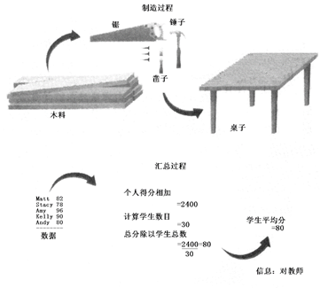

地理信息系统的基本概念
-------------------------

信息、数据、地理数据与地理信息
~~~~~~~~~~~~~~~~~~~~~~~~~~~~~~~~~~

信息（Information）
^^^^^^^^^^^^^^^^^^^^^^^^^^

**1）信息的含义**

信息是近代科学的一个专门术语，已广泛地应用于社会各个领域。狭义信息论将信息定义为“两次不定性之差”，即指人们获得信息前后对事物认识的差别；广义信息论认为，信息是指主体（人、生物或机器）与外部客体（环境、其他人、生物或机器）之间相互联系的一种形式，是主体和客体之间的一切有用的消息或知识，是表征事物特征的一种普遍形式。本书采用的定义为：信息是向人们或机器提供关于现实世界新的事实的知识，是数据、消息中所包含的意义，它不随载体物理设备形式的改变而改变。

**2）信息的特点**

信息具有以下特点：

-  客观性：任何信息都是与客观事实紧密相关的，这是信息正确性和精确度的保证；

-  实用性：信息对决策是十分重要的，信息系统将地理空间的巨大数据流收集、组织和管理起来，经过处理、转换和分析变为对生产、管理和决策具有重要意义的有用信息；

-  传输性：信息可以在信息发送者和接受者之间传输，既包括系统把有用信息送至终端设备（包括远程终端）和以一定的形式或格式提供给有关用户，也包括信息在系统内各个子系统之间的流转和交换，如网络传输技术；

-  共享性：信息与实物不同，信息可以传输给多个用户，为多个用户共享，而其本身并无损失。信息的这些特点，使信息成为当代社会发展的一项重要资源。

数据
^^^^^^^^^^^

数据是指某一目标定性、定量描述的原始资料，包括数字、文字、符号、图形、图像以及它们能转换成的数据等形式。数据是用以载荷信息的物理符号，数据本身并没有意义。如数字“1”。信息可以离开信息系统而独立存在，也可以离开信息系统的各个组成和阶段而独立存在；而数据的格式往往与计算机系统有关，并随载荷它的物理设备的形式而改变。

信息与数据是不可分离的。信息由与物理介质有关的数据表达，数据中所包含的意义就是信息。数据是记录下来的某种可以识别的符号，具有多种多样的形式，也可以由一种数据形式转换为其他数据形式，但其中包含的信息的内容不会改变。数据是信息的载体，但并不就是信息。只有理解了数据的含义，对数据做出解释，才能提取数据中所包含的信息。对数据进行处理（运算、排序、编码、分类、增强等）就是为了得到数据中包含的信息。虽然日常生活中数据和信息概念分得不是很清，但它们有着不同的含义。可以把数据比作原材料，而信息是对原材料处理的结果。如同一个木匠，在一些工具的帮助下，可以把木材做成有用的家具。同样，计算机专业人员应用计算机的硬件和软件把原始数据转换成信息。这种转换过程可用图1-1说明。

   数据和信息

数据包含原始事实，信息是把数据处理成有意义的和有用的形式。例如，每个学生所得分数对教师来说是原始数据，而把这些数据进行汇总并计算每班平均得分，教师根据平均分判断班级总体情况，这些结果对教师来说就是信息。与数据相比，信息具有以下特征：数据是原始事实，信息是数据处理的结果；对一个人是信息对其他人可能是数据；信息必须是有意义或有用的；使用的信息必须是完整、精确、相关和及时的。

人的知识、经验作用到数据上，可以得到信息，而获得信息量的多少，与人的知识水平有关。
