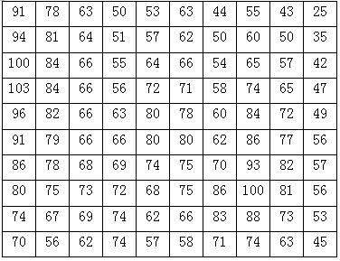

DEM的主要表示模型
--------------------

规则格网模型
~~~~~~~~~~~~~~~~

规则网格，通常是正方形，也可以是矩形、三角形等规则网格。
规则网格将区域空间切分为规则的格网单元，每个格网单元对应一个数值。
数学上可以表示为一个矩阵，在计算机实现中则是一个二维数组。
每个格网单元或数组的一个元素，对应一个高程值，如图9-2所示。

   图9-2：格网DEM

