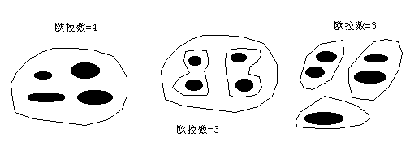

空间查询与量算
-----------------

查询和定位空间对象，并对空间对象进行量算是地理信息系统的基本功能之一，它是地理信息系统进行高层次分析的基础。在地理信息系统中，为进行高层次分析，往往需要查询定位空间对象，并用一些简单的量测值对地理分布或现象进行描述，如长度，面积，距离，形状等。实际上，空间分析首先始于空间查询和量算，它是空间分析的定量基础。

空间查询
~~~~~~~~~~~~

图形与属性互查是最常用的查询，主要有两类：第一类是按属性信息的要求来查询定位空间位置，称为“属性查图形”。如在中国行政区划图上查询人口大于4000万且城市人口大于1000万的省有哪些，这和一般非空间的关系数据库的SQL查询没有区别，查询到结果后，再利用图形和属性的对应关系，进一步在图上用指定的显示方式将结果定位绘出。第二类是根据对象的空间位置查询有关属性信息，称为“图形查属性”。如一般地理信息系统软件都提供一个“INFO”工具，让用户利用光标，用点选、画线、矩形、圆、不规则多边形等工具选中地物，并显示出所查询对象的属性列表，可进行有关统计分析。该查询通常分为两步，首先借助空间索引，在地理信息系统数据库中快速检索出被选空间实体，然后根据空间实体与属性的连接关系即可得到所查询空间实体的属性列表。

在大多数GIS中，提供的空间查询方式有：

**1）基于空间关系查询**

空间实体间存在着多种空间关系，包括拓扑、顺序、距离、方位等关系。通过空间关系查询和定位空间实体是地理信息系统不同于一般数据库系统的功能之一。如查询满足下列条件的城市：

-  *在京沪线的东部*

-  *距离京沪线不超过50公里*

-  *城市人口大于100万*

-  *城市选择区域是特定的多边形；*

整个查询计算涉及了空间顺序方位关系（京沪线东部），空间距离关系（距离京沪线不超过50公里），空间拓扑关系（使选择区域是特定的多边形），甚至还有属性信息查询（城市人口大于100万）。

简单的面、线、点相互关系的查询包括：

-  面面查询，如与某个多边形相邻的多边形有哪些。

-  面线查询，如某个多边形的边界有哪些线。

-  面点查询，如某个多边形内有哪些点状地物。

-  线面查询，如某条线经过（穿过）的多边形有哪些，某条链的左、右多边形是哪些。

-  线线查询，如与某条河流相连的支流有哪些，某条道路跨过哪些河流。

-  线点查询，如某条道路上有哪些桥梁，某条输电线上有哪些变电站。

-  点面查询，如某个点落在哪个多边形内。

-  点线查询，如某个结点由哪些线相交而成。

**2）基于空间关系和属性特征查询**

传统的关系数据库的标准SQL并不能处理空间查询，这是由于关系数据库技术的弱点造成的，对于GIS而言，需要对SQL进行扩展。对于传统的SQL，要实现空间操作，需要将SQL命令嵌入一种编程语言中，如C语言；而新的SQL允许用户定义自己的操作，并嵌入到SQL命令中。

**3）地址匹配查询**

根据街道的地址来查询事物的空间位置和属性信息是地理信息系统特有的一种查询功能，这种查询利用地理编码，输入街道的门牌号码，就可知道大致的位置和所在的街区。它对空间分布的社会、经济调查和统计很有帮助，只要在调查表中添了地址，地理信息系统可以自动地从空间位置的角度来统计分析各种经济社会调查资料。另外这种查询也经常用于公用事业管理，事故分析等方面，如邮政、通讯、供水、供电、治安、消防、医疗等领域。

空间量算
~~~~~~~~~~~~

几何量算
^^^^^^^^^^^^^^^

几何量算对不同的点、线、面地物有不同的含义：

-  点状地物（0维）：坐标；

-  线状地物（1维）：长度，曲率，方向；

-  面状地物（2维）：面积，周长，形状，曲率等；

-  体状地物（3维）：体积，表面积等。

一般的GIS软件都具有对点、线、面状地物的几何量算功能，或者是针对矢量数据结构，或者是针对栅格数据结构的空间数据。

**1）线的长度计算**

线状地物对象最基本的形态参数之一是长度。在矢量数据结构下，线表示为点对坐标（X，Y）或（X，Y，Z）的序列，在不考虑比例尺情况下，线长度的计算公式为：

对于复合线状地物对象，则需要在对诸分支曲线求长度后，再求其长度总和。

通过离散坐标点对串来表达线对象，选择反映曲线形状的选点方案非常重要，往往由于选点方案不同，会带来长度计算的不同精度问题。为提高计算精度，增加点的数目，会对数据获取、管理与分析带来额外的负担，折中的选点方案是在曲线的拐弯处加大点的数目，在平直段减少点数，以达到计算允许精度要求。

在栅格数据结构里，线状地物的长度就是累加地物骨架线通过的格网数目，骨架线通常采用8方向连接，当连接方向为对角线方向时，还要乘上。

**2）面状地物的面积**

面积是面状地物最基本的参数。在矢量结构下，面状地物以其轮廓边界弧段构成的多边形表示的。对于没有空洞的简单多边形，假设有N个顶点，其面积计算公式为：

所采用的是几何交叉处理方法，即沿多边形的每个顶点作垂直与X轴的垂线，然后计算每条边、它的两条垂线及这两条垂线所截得X轴部分所包围的面积，所求出的面积的代数和，即为多边形面积。对于有孔或内岛的多边形，可分别计算外多边形与内岛面积，其差值为原多边形面积。此方法亦适合于体积的计算。

对于栅格结构，多边形面积计算就是统计具有相同属性值的格网数目。但对计算破碎多边形的面积有些特殊，可能需要计算某一个特定多边形的面积，必须进行再分类，将每个多边形进行分割赋给单独的属性值，之后再进行统计。

形状量算
^^^^^^^^^^^^^^^

面状地物形状量测的两个基本考虑：空间一致性问题，即有孔多边形和破碎多边形的处理；多边形边界特征描述问题。

度量空间一致性最常用的指标是欧拉函数，用来计算多边形的破碎程度和孔的数目。欧拉函数的结果是一个数，称为欧拉数。欧拉函数的计算公式为：

::

    Euler_number = (number_of_holes) - (number_of_pieces - 1)

图8-1表示了多边形的三种可能的情形。

图8-1：欧拉数

